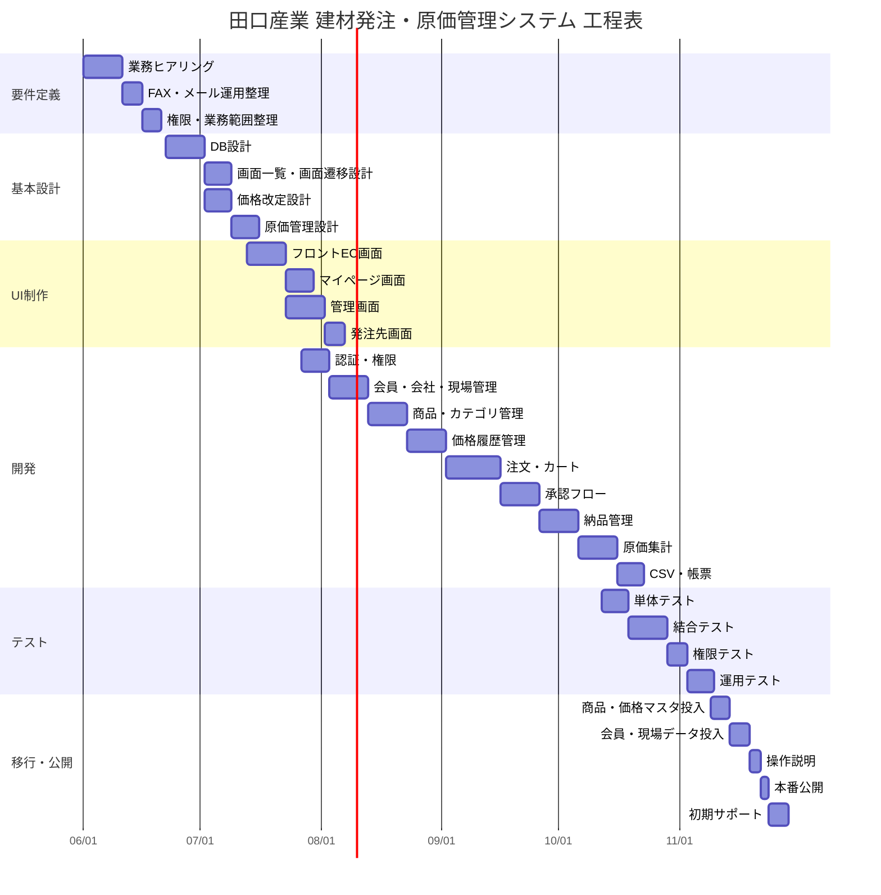

# 工程ガントチャート

```mermaid
gantt
title 田口産業 建材発注・原価管理システム 工程表
dateFormat YYYY-MM-DD
axisFormat %m/%d

section 要件定義
業務ヒアリング              :a1, 2026-06-01, 10d
FAX・メール運用整理          :a2, after a1, 5d
権限・業務範囲整理            :a3, after a2, 5d

section 基本設計
DB設計                       :b1, 2026-06-22, 10d
画面一覧・画面遷移設計        :b2, after b1, 7d
価格改定設計                 :b3, after b1, 7d
原価管理設計                 :b4, after b3, 7d

section UI制作
フロントEC画面               :c1, 2026-07-13, 10d
マイページ画面               :c2, after c1, 7d
管理画面                     :c3, after c1, 10d
発注先画面                   :c4, after c3, 5d

section 開発
認証・権限                   :d1, 2026-07-27, 7d
会員・会社・現場管理          :d2, after d1, 10d
商品・カテゴリ管理            :d3, after d2, 10d
価格履歴管理                 :d4, after d3, 10d
注文・カート                 :d5, after d4, 14d
承認フロー                   :d6, after d5, 10d
納品管理                     :d7, after d6, 10d
原価集計                     :d8, after d7, 10d
CSV・帳票                    :d9, after d8, 7d

section テスト
単体テスト                   :e1, 2026-10-12, 7d
結合テスト                   :e2, after e1, 10d
権限テスト                   :e3, after e2, 5d
運用テスト                   :e4, after e3, 7d

section 移行・公開
商品・価格マスタ投入          :f1, 2026-11-09, 5d
会員・現場データ投入          :f2, after f1, 5d
操作説明                     :f3, after f2, 3d
本番公開                     :f4, after f3, 2d
初期サポート                 :f5, after f4, 5d
```
