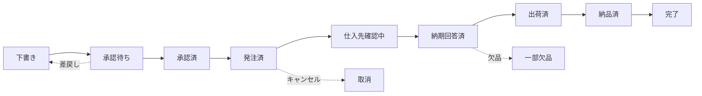

# 注文ステータス

```mermaid
flowchart LR

A[下書き]
B[承認待ち]
C[承認済]
D[発注済]
E[仕入先確認中]
F[納期回答済]
G[出荷済]
H[納品済]
I[完了]

A --> B
B --> C
C --> D
D --> E
E --> F
F --> G
G --> H
H --> I

B -.差戻し.-> A
D -.キャンセル.-> X[取消]
F -.欠品.-> Y[一部欠品]
```
