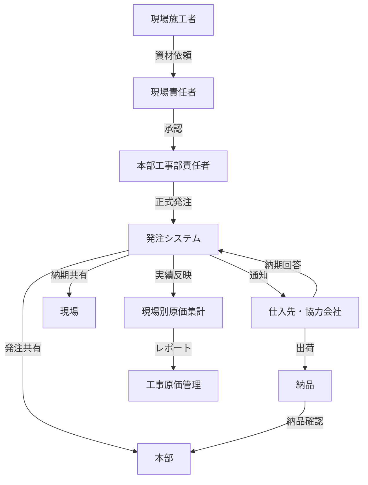

# 業務フロー

```mermaid
flowchart TD

A[現場施工者] -->|資材依頼| B[現場責任者]
B -->|承認| C[本部工事部責任者]
C -->|正式発注| D[発注システム]

D -->|通知| E[仕入先・協力会社]
E -->|納期回答| D

D -->|納期共有| F[現場]
D -->|発注共有| G[本部]

E -->|出荷| H[納品]
H -->|納品確認| G

D -->|実績反映| I[現場別原価集計]
I -->|レポート| J[工事原価管理]
```
