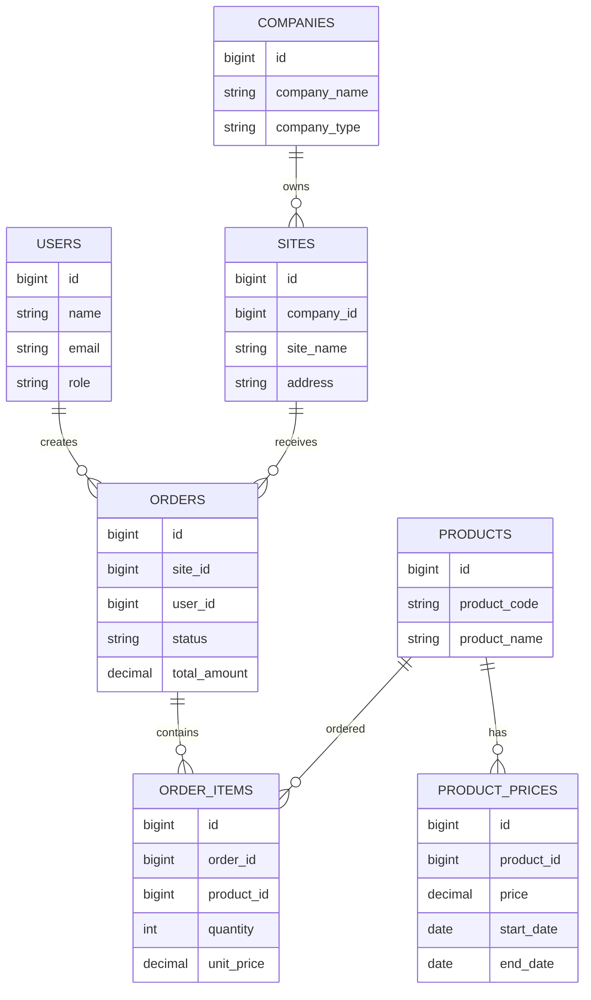

# DB概念図

```mermaid
erDiagram

USERS {
    bigint id
    string name
    string email
    string role
}

COMPANIES {
    bigint id
    string company_name
    string company_type
}

SITES {
    bigint id
    bigint company_id
    string site_name
    string address
}

PRODUCTS {
    bigint id
    string product_code
    string product_name
}

PRODUCT_PRICES {
    bigint id
    bigint product_id
    decimal price
    date start_date
    date end_date
}

ORDERS {
    bigint id
    bigint site_id
    bigint user_id
    string status
    decimal total_amount
}

ORDER_ITEMS {
    bigint id
    bigint order_id
    bigint product_id
    int quantity
    decimal unit_price
}

USERS ||--o{ ORDERS : creates
COMPANIES ||--o{ SITES : owns
SITES ||--o{ ORDERS : receives
ORDERS ||--o{ ORDER_ITEMS : contains
PRODUCTS ||--o{ ORDER_ITEMS : ordered
PRODUCTS ||--o{ PRODUCT_PRICES : has
```
