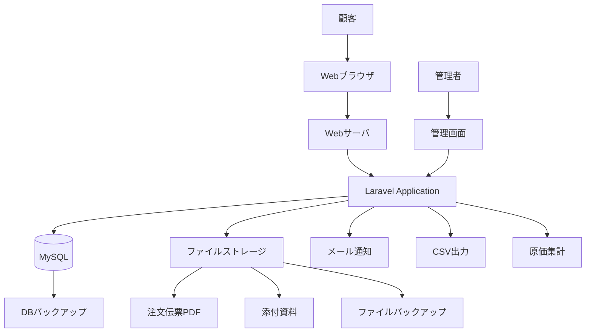
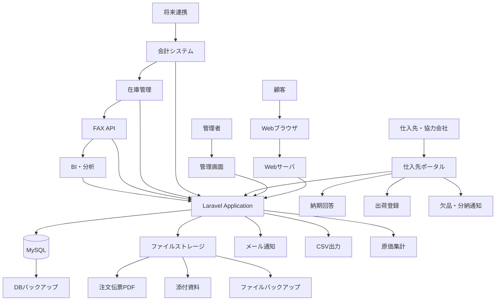

# インフラ構成図（MVP構成）

```mermaid
graph TD

A[顧客]
--> B[Webブラウザ]

B --> C[Webサーバ]
C --> D[Laravel Application]

D --> E[(MySQL)]

D --> F[ファイルストレージ]
F --> G[注文伝票PDF]
F --> H[添付資料]

D --> I[メール通知]
D --> J[CSV出力]
D --> K[原価集計]

E --> L[DBバックアップ]
F --> M[ファイルバックアップ]

N[管理者]
--> O[管理画面]

O --> D
```

---

# インフラ構成図（拡張構成：フェーズ２以降）

## フェーズ２で追加される主な機能

- 仕入先ポータル
- 納期回答
- 出荷登録
- 欠品・分納通知
- 会計システム連携
- 在庫管理連携
- BI・分析機能
- FAX API連携

```mermaid
graph TD

A[顧客]
--> B[Webブラウザ]

B --> C[Webサーバ]
C --> D[Laravel Application]

D --> E[(MySQL)]

D --> F[ファイルストレージ]
F --> G[注文伝票PDF]
F --> H[添付資料]

D --> I[メール通知]
D --> J[CSV出力]
D --> K[原価集計]

E --> L[DBバックアップ]
F --> M[ファイルバックアップ]

N[管理者]
--> O[管理画面]

O --> D

P[仕入先・協力会社]
--> Q[仕入先ポータル]

Q --> D

Q --> R[納期回答]
Q --> S[出荷登録]
Q --> T[欠品・分納通知]

U[将来連携]
--> V[会計システム]
--> W[在庫管理]
--> X[FAX API]
--> Y[BI・分析]

V --> D
W --> D
X --> D
Y --> D
```
